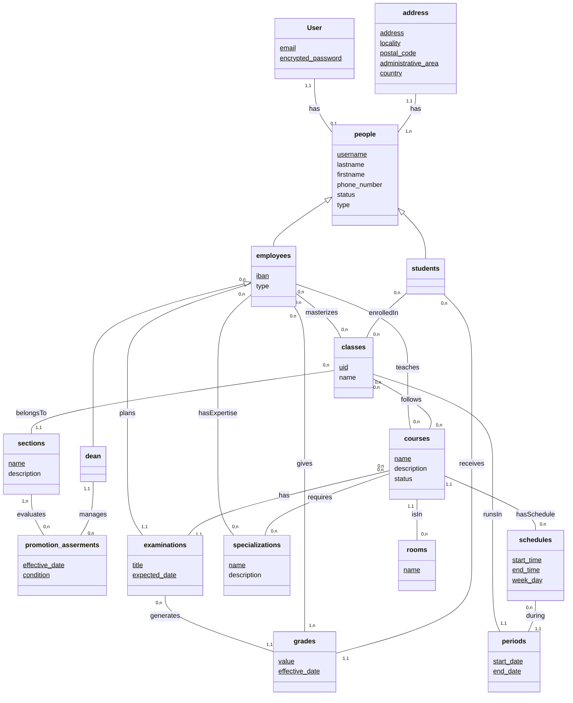

```mermaid

classDiagram
    class User {
        email$
        encrypted_password$
    }
    class people {
        username$
        lastname
        firstname
        phone_number
        status
        type
    }
    class students { }
    class employees {
        iban$
        type
    }
    class dean { }
    class address {
        address$
        locality$
        postal_code$
        administrative_area$
        country$
    }
    class sections{
        name$
        description
    }
    class promotion_asserments {
        effective_date$
        condition$
    }
    class schedules {
        start_time$
        end_time$
        week_day$
    }
    class periods {
        start_date$
        end_date$
    }
    class specializations {
        name$
        description
    }
    class examinations {
        title$
        expected_date$
    }
    class courses {
        name$
        description
        status
    }
    class grades {
        value$
        effective_date$
    }
    class classes {
        uid$
        name
    }
    class rooms{
        name$
    }

    User "1,1" -- "0,1" people: has
    address "1,1" -- "1,n" people: has
    people <|-- students
    people <|-- employees
    employees <|-- dean

    employees "0,n" -- "0,n" courses: teaches
    classes "0,n" -- "0,n" courses: follows
    courses "1,1" -- "0,n" rooms: isIn
    employees "0,n" -- "1,1" examinations: plans
    courses "0,n" -- "1,1" examinations: has
    examinations "0,n" -- "1,1" grades: generates
    employees "0,n" -- "1,n" grades: gives
    students "0,n" -- "1,1" grades: receives
    
    employees "0,n" -- "0,n" specializations: hasExpertise
    courses "0,n" -- "0,n" specializations: requires
    
    employees "0,n" -- "0,n" classes: masterizes
    students "0,n" -- "0,n" classes: enrolledIn
    
    classes "0,n" -- "1,1" sections: belongsTo
    classes "0,n" -- "1,1" periods: runsIn
    
    courses "1,1" -- "0,n" schedules: hasSchedule
    schedules "0,n" -- "1,1" periods: during
    
    sections "1,n" -- "0,n" promotion_asserments: evaluates

    dean "1,1" -- "0,n" promotion_asserments: manages
```
