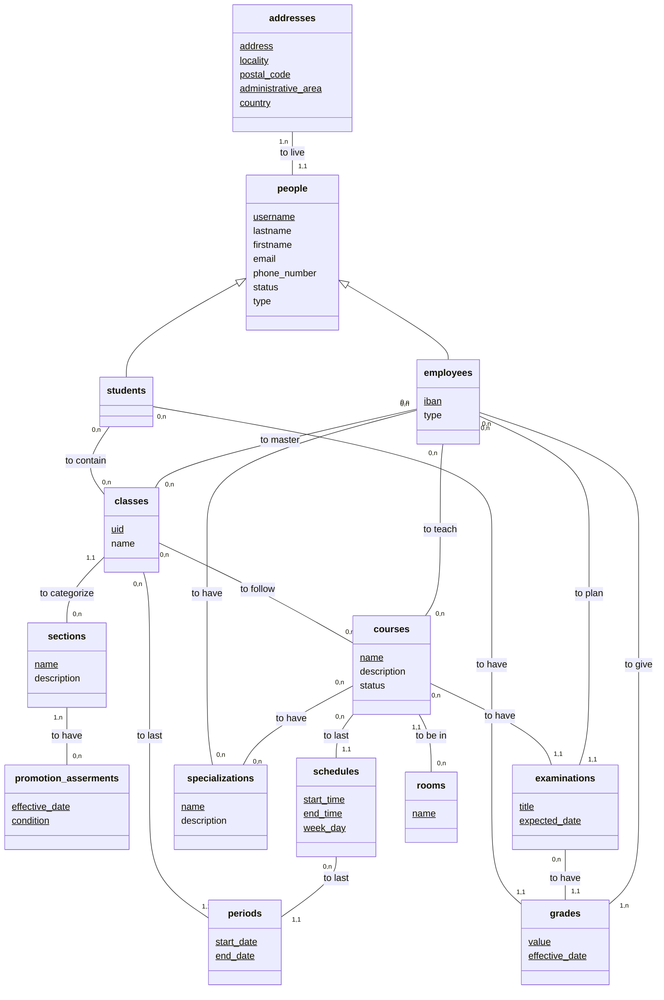

```mermaid

classDiagram
    class addresses {
        address$
        locality$
        postal_code$
        administrative_area$
        country$
    }
    class sections{
        name$
        description
    }
    class promotion_asserments {
        effective_date$
        condition$
    }
    class schedules {
        start_time$
        end_time$
        week_day$
    }
    class periods {
        start_date$
        end_date$
    }
    class people {
        username$
        lastname
        firstname
        email
        phone_number
        status
        type
    }
    class students { }
    class employees {
        iban$
        type
    }
    class specializations {
        name$
        description
    }
    class examinations {
        title$
        expected_date$
    }
    class courses {
        name$
        description
        status
    }
    class grades {
        value$
        effective_date$
    }
    class classes {
        uid$
        name
    }
    class rooms{
        name$
    }

    people <|-- students
    people <|-- employees

    employees "0,n" -- "0,n" courses: to teach
    classes "0,n" -- "0,n" courses: to follow
    addresses "1,n" -- "1,1" people: to live
    employees "0,n" -- "1,1" examinations: to plan
    courses "0,n" -- "1,1" examinations: to have
    courses "0,n" -- "0,n" specializations: to have
    employees "0,n" -- "0,n" specializations: to have
    employees "0,n" -- "1,n" grades: to give
    examinations "0,n" -- "1,1" grades: to have
    students "0,n" -- "1,1" grades: to have
    employees "0,n" -- "0,n" classes: to master
    students "0,n" -- "0,n" classes: to contain
    schedules "0,n" -- "1,1" periods: to last
    classes "0,n" -- "1,1" periods: to last
    courses "0,n" -- "1,1" schedules: to last
    classes "1,1" -- "0,n" sections: to categorize
    sections "1,n" -- "0,n" promotion_asserments: to have
    courses "1,1" -- "0,n" rooms: to be in
```
