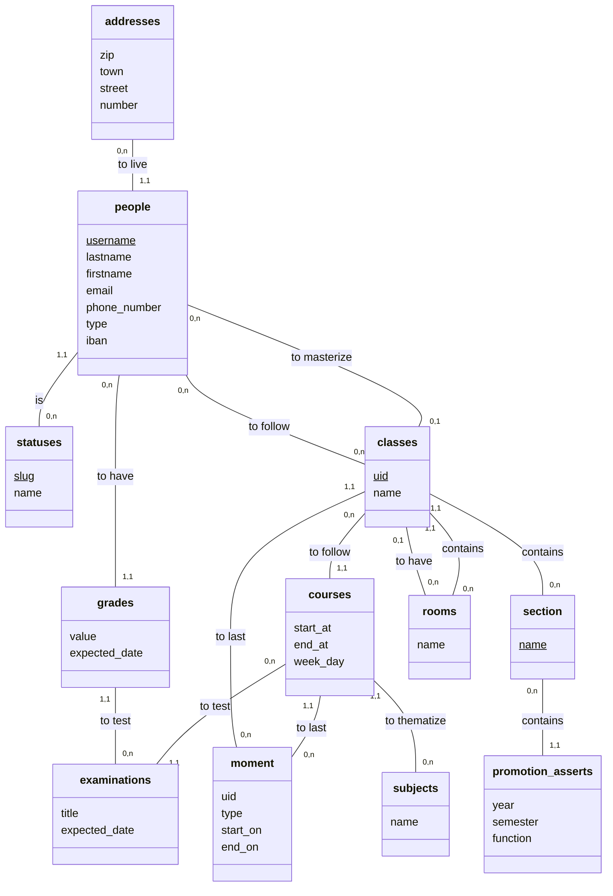

```mermaid
classDiagram
    class addresses {
        zip
        town
        street
        number
    }
    class people{
        username$
        lastname
        firstname
        email
        phone_number
        type
        iban
    }
    class statuses{
        slug$
        name
    }
    class classes{
        uid$
        name
    }
    class moment {
        uid
        type
        start_on
        end_on
    }
    class promotion_asserts{
        year
        semester
        function
    }
    class grades {
        value
        expected_date
    }
    class examinations {
        title
        expected_date
    }
    class courses {
        start_at
        end_at
        week_day
    }
    class subjects {
        name
    }
    class section {
        name$
    }
    class rooms {
        name
    }

    addresses "0,n" -- "1,1" people: to live
    people "0,n" -- "0,n" classes: to follow
    people "0,n" -- "0,1" classes: to masterize
    people "1,1" -- "0,n" statuses: is
    people "0,n" -- "1,1" grades: to have
    classes "0,n" -- "1,1" courses: to follow
    classes "1,1" -- "0,n" moment: to last
    classes "0,1" -- "0,n" rooms: to have
    classes "1,1" -- "0,n" rooms: contains
    classes "1,1" -- "0,n" section: contains
    grades "1,1" -- "0,n" examinations: to test
    courses "0,n" -- "1,1" examinations: to test
    courses "1,1" -- "0,n" moment: to last
    courses "1,1" -- "0,n" subjects: to thematize
    section "0,n" -- "1,1" promotion_asserts: contains
```
