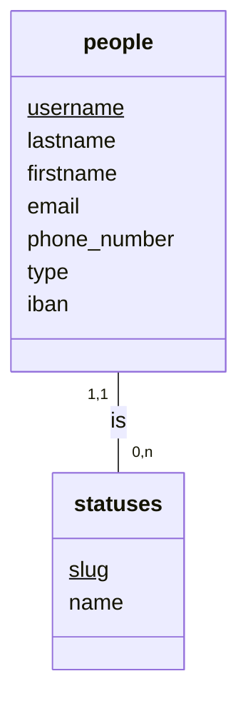
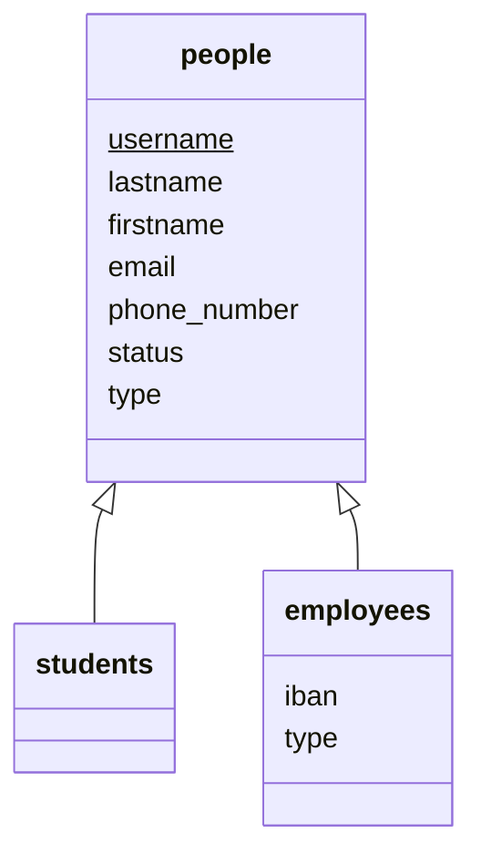
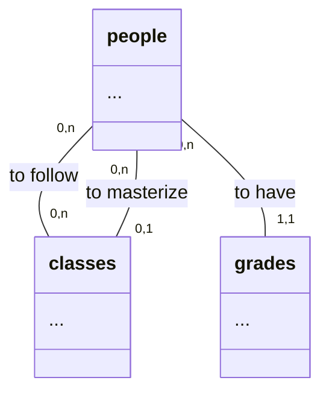
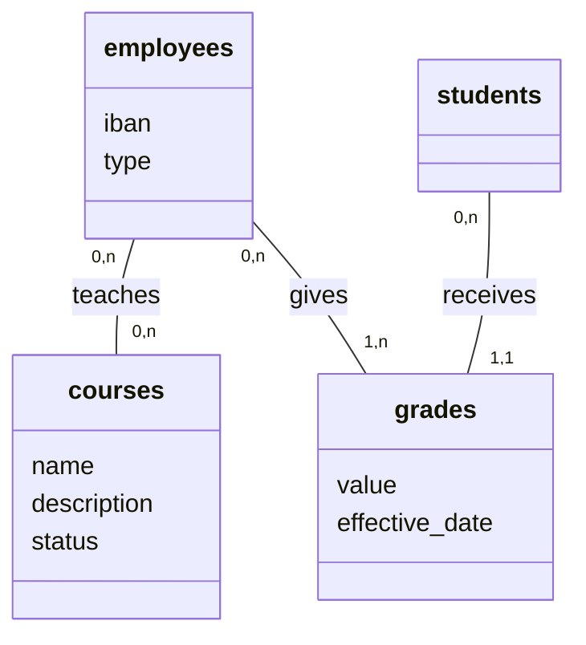
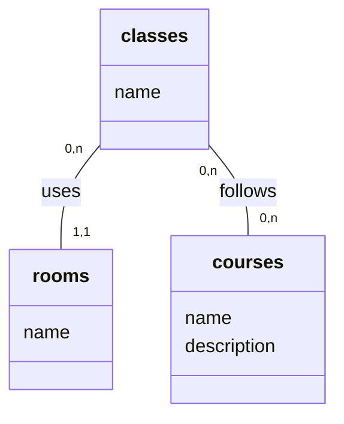
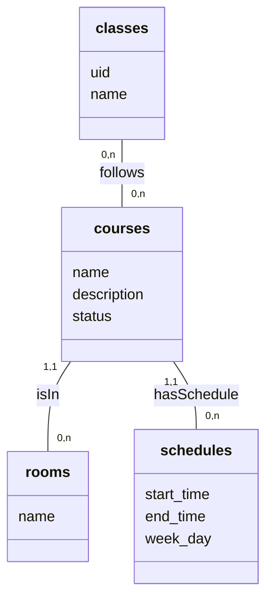
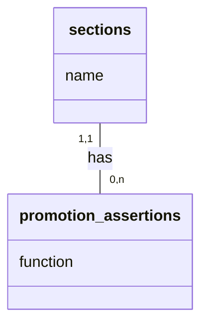
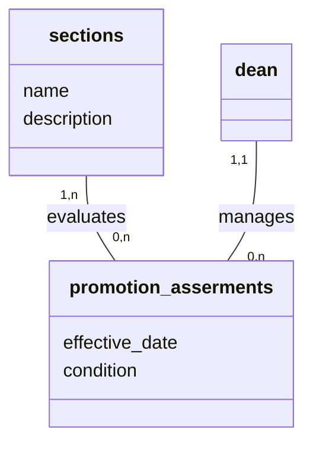

# Report

## Conceptual Data Model (CDM)

### Updates made to the base CDM

#### Authentication and People entity

- Added User entity to handle authentication through Devise
- Made the inheritance explicit with proper STI (Single Table Inheritance) implementation
- People have a polymorphic type field for STI ("Student", "Employee", "Dean")
- Added status field ("active"/"archived") for soft deletion
- Employees have additional type field to differentiate roles
- All people require an address with proper international format
- Removed iban from base People entity, moved to Employee

<table>
<tr>
<th> Before </th>
<th> After </th>
</tr>
<tr>
<td>

</td>
<td>

</td>
</table>

#### Role-Based Structure

- Dean is now a specialized type of Employee with additional management capabilities
- Employees (including teachers) have specialized relationships:
  - Can teach courses
  - Can plan examinations
  - Can give grades
  - Can masterize classes
  - Have specializations (areas of expertise)
- Students have their own specialized relationships:
  - Can be enrolled in classes
  - Receive grades
  - Take examinations

<table>
<tr>
<th> Before </th>
<th> After </th>
</tr>
<td>

</td>
<td>

</td>
</tr>
</table>

#### Academic Structure

- Improved course and class management with clear separation of concerns

<table>
<tr>
<th> Before </th>
<th> After </th>
</tr>
<td>

</td>
<td>

</td>
</tr>
</table>

#### Promotion Management

- Enhanced promotion management with proper conditions and relationships

<table>
<tr>
<th> Before </th>
<th> After </th>
</tr>
<td>

</td>
<td>

</td>
</tr>
</table>
