# Report

## Conceptual Data Model (CDM)

### Updates made to the base CDM flow

#### People entity

Made the inheritance explicit. Renamed `teachers` to `employees` added `type` attribute to specify their "roles"("dean", "teacher", etc...).
Added `status` attribute to `people` to specify if they are active or not.
The `type` in people and employees is there to define which type (student, teacher, dean, etc...) they inherit from. It's the way `Devise` handles the inheritance. 

<table>
<tr>
<th> Before </th>
<th> After </th>
</tr>
<tr>
<td>

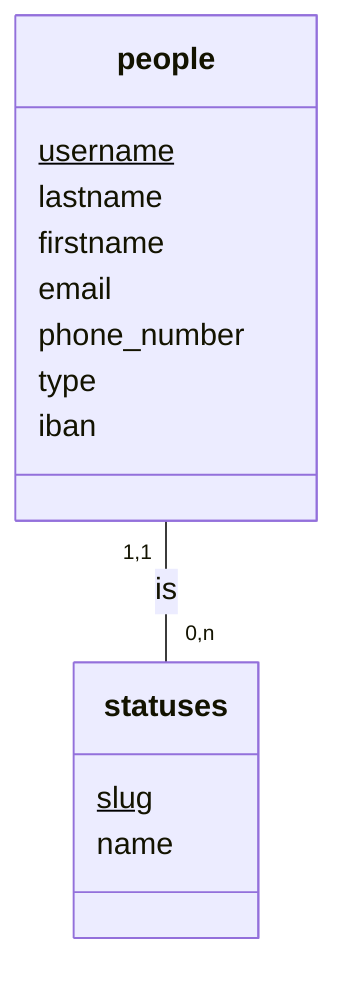

</td>
<td>

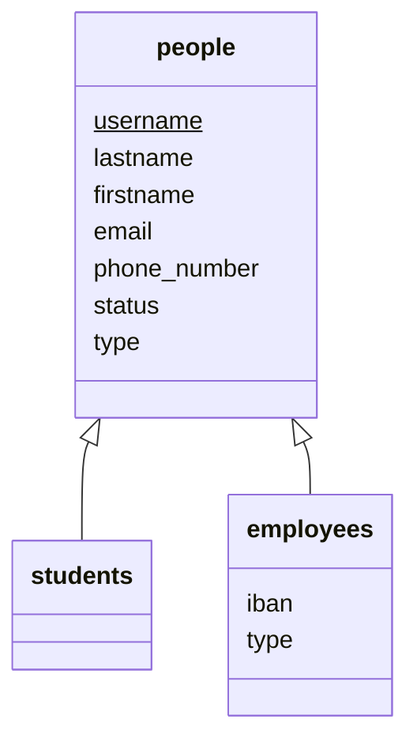

</td>
</table>

#### Students & Employees links

Now that the inheritance is explicit, the entity `people` is no more linked to any real entity except addresses.

This allows us to have a better separation of concerns and to have a more explicit model. 

`Students` now have `grades` and `classes` to be in. `Employees` have `specializations` and `courses` to teach. They also masterize `classes` and give `grades`. Finally `employees` plan `examinations`.

> I will not detail the changes of the workflow here, but they are detailed in the next section.
>
> Also note that the entities having "..." in their class diagram are not detailed here, but they are in the full CDM and their respective workflow.

<table>
<tr>
<th> Before </th>
<th> After </th>
</tr>
<td>

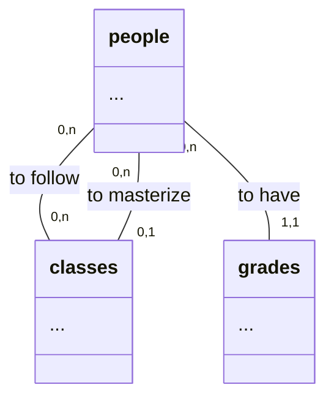

</td>
<td>

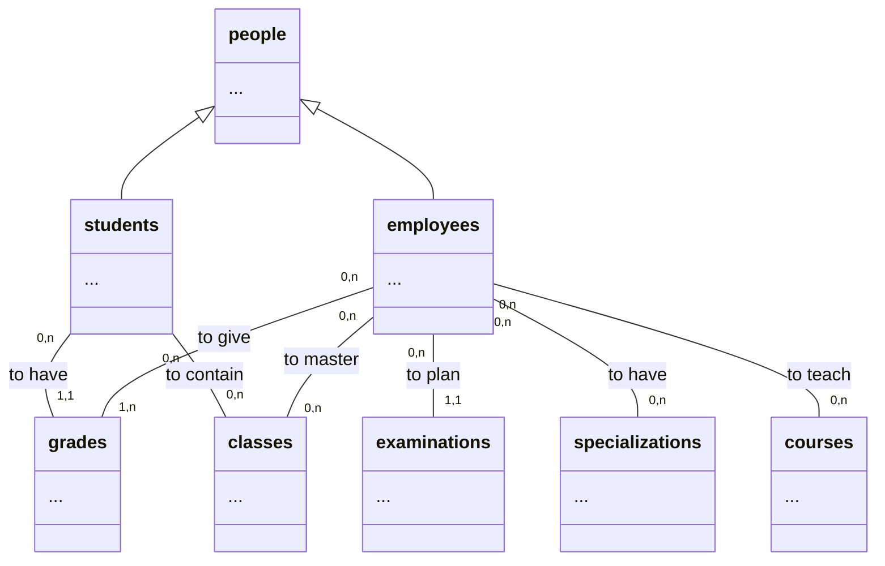

</td>
</table>

#### Grades & examination workflow

The workflow of the grades and examinations has been updated to reflect the changes in the CDM.

Now `grades` are given by `employees` and `students` have them. `Examinations` are planned by `employees` and are linked to `courses`.

This modification allows us to have a more explicit model and to have a better separation of concerns.

Added the unique constraint on `grades` and `examinations`.

<table>
<tr>
<th> Before </th>
<th> After </th>
</tr>
<td>

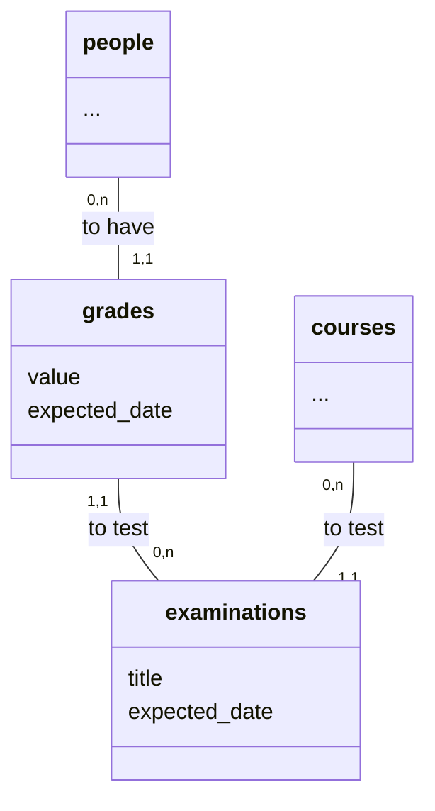

</td>
<td>

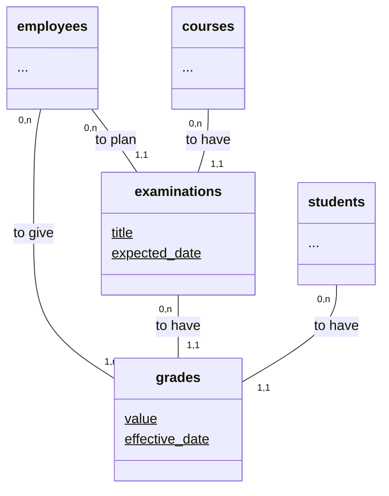

</td>
</table>

#### Promotion Assertion

`promotion_asserts` has been renamed to `promotion_asserments` and has been updated.

Now `promotion_asserments` have `effective_date` and `condition` attributes. The idea of the base CDM was to give a code function in the column which is not a good idea. It's better to have a condition that can be evaluated.

The effective date is there to specify when the promotion is effective.

For the `sections`, I added a `description` attribute to have a the description of the section.

I also changed the relationship between `classes` and `sections` to be more explicit and same for the relationship between `sections` and `promotion_asserments`.

<table>
<tr>
<th> Before </th>
<th> After </th>
</tr>
<td>

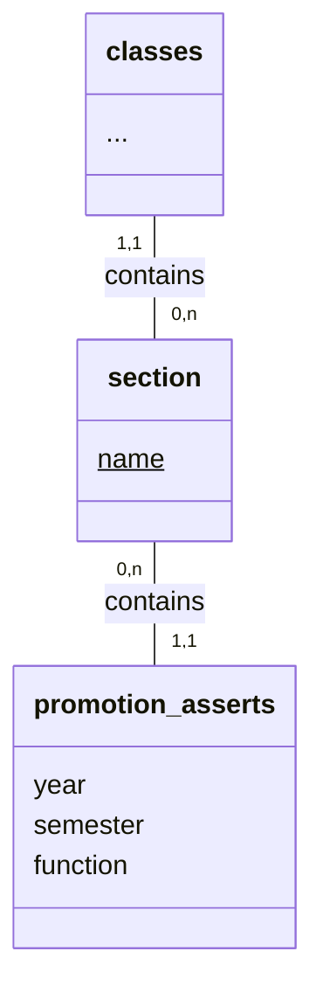

</td>
<td>

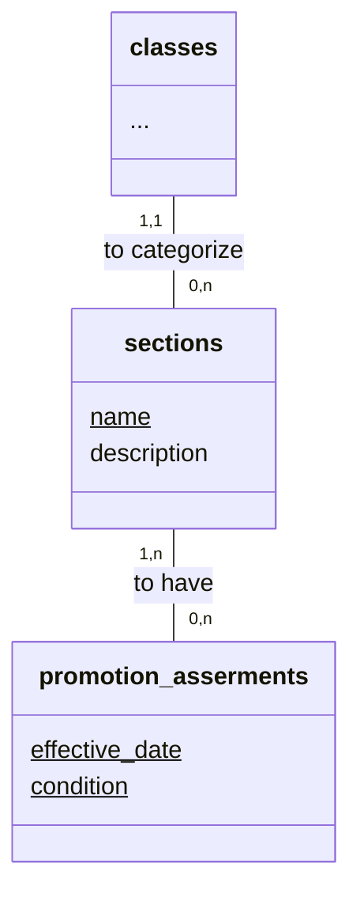

</td>
</table>

#### Rooms management

Now the `rooms` are no more linked to classes but to `courses`. This is because the room a class will be in is defined by the course they are following and not by the class. It allows the classes to move around for specific courses.

`Rooms` have been updated to have the `name` attribute as a unique identifier.

<table>
<tr>
<th> Before </th>
<th> After </th>
</tr>
<td>

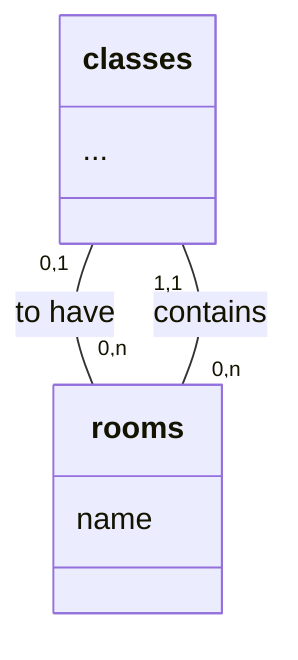

</td>
<td>

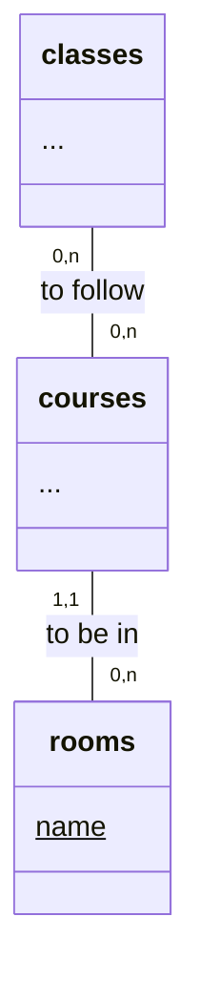

</td>
</table>

#### Schedules & Periods

The `moment` entity has been split into `schedules` and `periods`. The idea is to have a management of the time when courses are done during a day and the week and the period of time when they are done(for instance, a trimester).

The relationship between `classes` and `periods` has the same purpose but for the period of time when the classes are done(for instance, a year).

<table>
<tr>
<th> Before </th>
<th> After </th>
</tr>
<td>

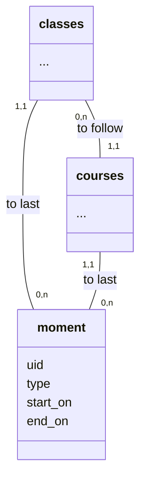

</td>
<td>

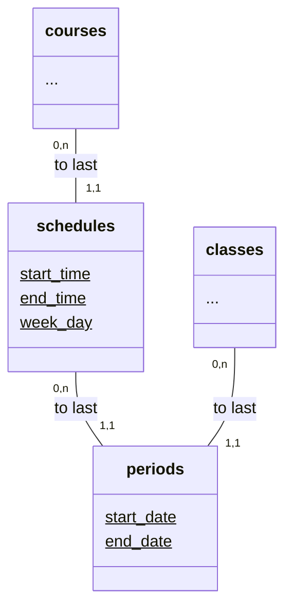

</td>
</table>

#### Specializations/Subjects

The `subjects` entity has been renamed to `specializations` and has been updated.

Now `specializations` have a `description` attribute to have a description of the specialization and the name is the unique identifier.

This change allows us to know which employees are able to teach which courses.

<table>
<tr>
<th> Before </th>
<th> After </th>
</tr>
<td>

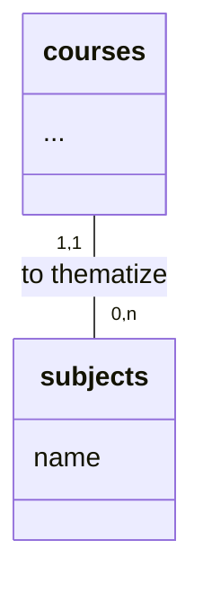

</td>
<td>

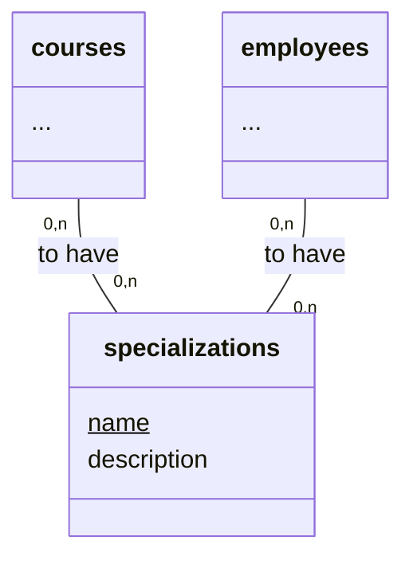

</td>
</table>

### Updates made to the base CDM entities attributes

This section will cover the changes made to the attributes of the entities which are not directly in relation with the changes made to the workflow.

#### Addresses entity

Renaming of the attributes:
* `town` -> `locality`
* `zip` -> `postal_code`
* `street` -> `address`.
  
> better looking names and more accurate.
 
Added `administrative_area` and `country` attributes.
> to make the address more complete and to be able to handle international addresses.

<table>
<tr>
<th> Before </th>
<th> After </th>
</tr>
<tr>
<td>

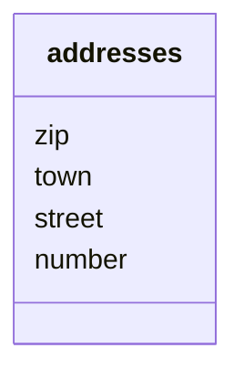

</td>
<td>

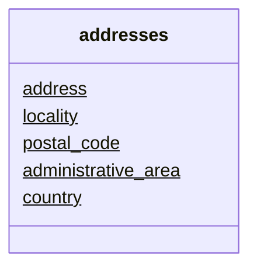

</td>
</table>
